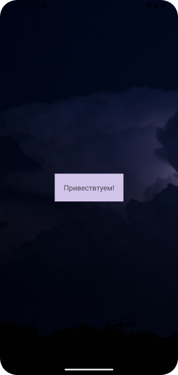
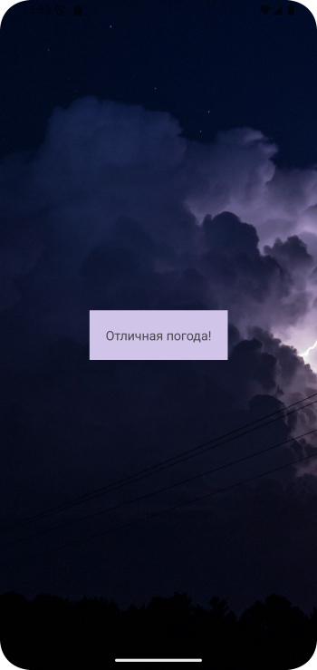
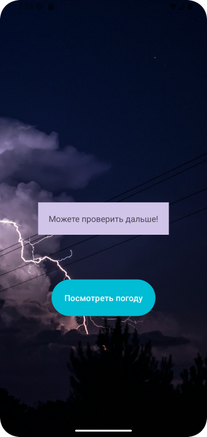
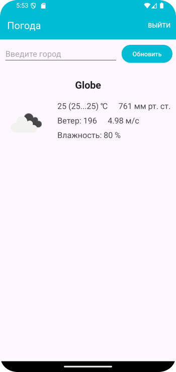
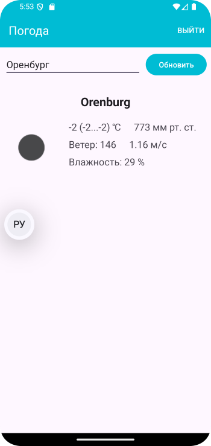

# Домашнее задание по теме "Retrofite Weather APi"

## Дорабатываем приложение «Погода». 

Необходимо доработать приложение, добавив в него ViewPager2, который в течение 2-3 страниц слайдера проинформирует пользователя, что ему предстоит пользоваться приложением о погоде. Во ViewPager2 можно в сочетании с текстовым описанием использовать изображения, скачанные с интернета. При запуске основного экрана приложения получение данных о погоде происходит при нажатии на кнопку **«Получить данные»**. Данные можно получить, использовав поле ввода города. Информацию о погоде на экране необходимо сделать более полной, т.е. добавить максимальную, минимальную температуру, влажность и тд. Кроме того, поля вывода информации, фон экрана, цвет кнопки, шрифты (цвет и размер), **Toolbar** и его заголовок необходимо сделать стилизовано по цвету, для гармоничного восприятия законченного приложения. Цвета для этого необходимо сохранить в файле ресурсов. Выход из приложения может выполняться по нажатию на пункт меню.

Для работы приложения необходимо создать:

1. **Toolbar** с заголовком.

2. Слайдер на основе **ViewPager2**.

3. Поле ввода города для получения данных.

4. Кнопка **«Получить данные»**.

5. Поля вывода данных о погоде.

6. Меню с пунктом **«Exit»**.

Логика работы приложения при получении данных аналогична тематики отработанного занятия.

**\*\*\*Необязательно, но желательно (усложненный уровень).**

Реализовать получение данных о погоде относительно текущего местоположения. Т.е. на основном экране будут располагаться две кнопки: первая - для получения погоды для введенного города, вторая -  для получения погоды для текущего местоположения. В этом случае для формирования запроса необходимо использовать параметры lat lon.

Приложение необходимо сохранить проектом в удаленном репозитории, для проверки качества предоставить ссылку преподавателю, либо сделать скрины эмулятора при каждом шаге работы приложения или снять видео экрана при работе приложения.

## Скриншоты домашенего задания по теме "Retrofite Weather APi"

Скриншоты здесь

